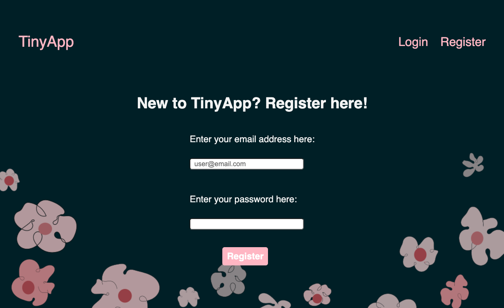
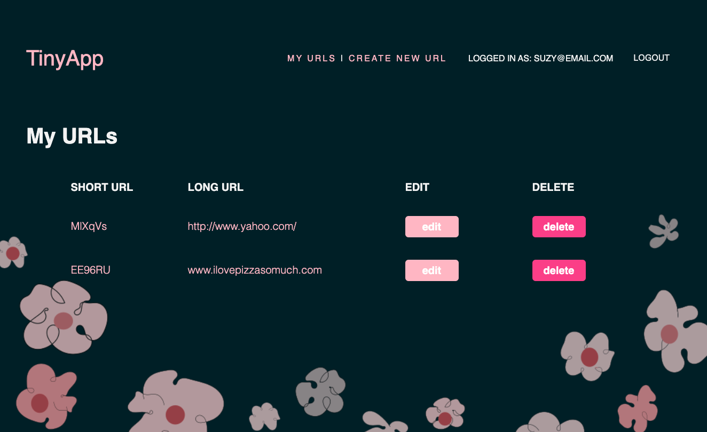
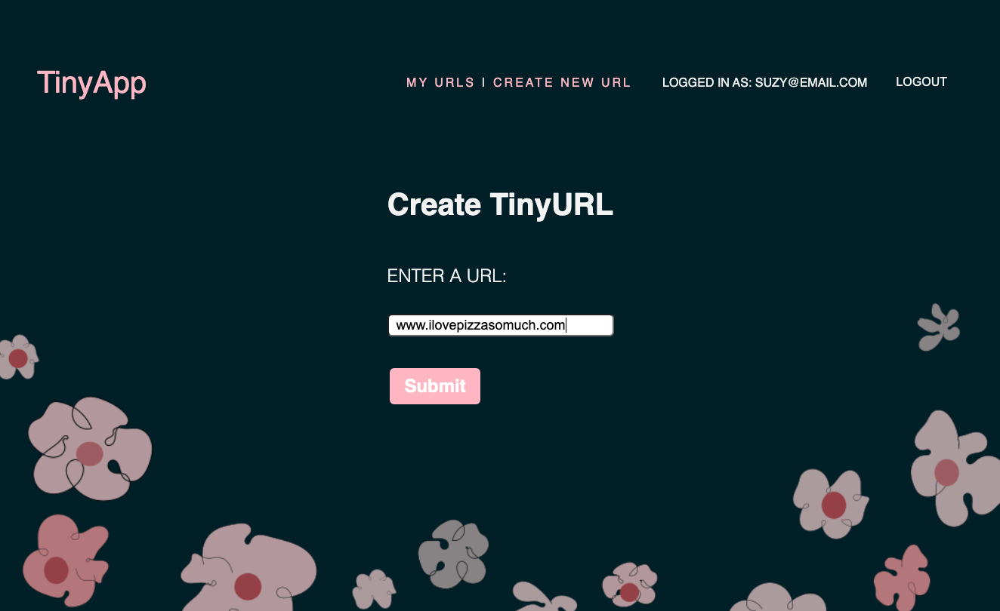

# TinyApp Project

TinyApp is a full stack web application built with Node and Express that allows users to shorten long URLs (à la bit.ly).

## Final Product

### register page

### url list page

### create new tiny url

### tiny app in action

## Dependencies

- Node.js
- Express
- EJS
- bcrypt
- body-parser
- cookie-session

## Getting Started

- Install all dependencies (using the `npm install` command).
- Run the development web server using the `node express_server.js` command.

## Future updates scheduled for TinyApp

- This app is a work in progress - functionality can be improved and streamlines.

- You may have noticed the layout is not very friendly. I plan to implement user interface that makes navigation more intuitive and easier on the eyes.
